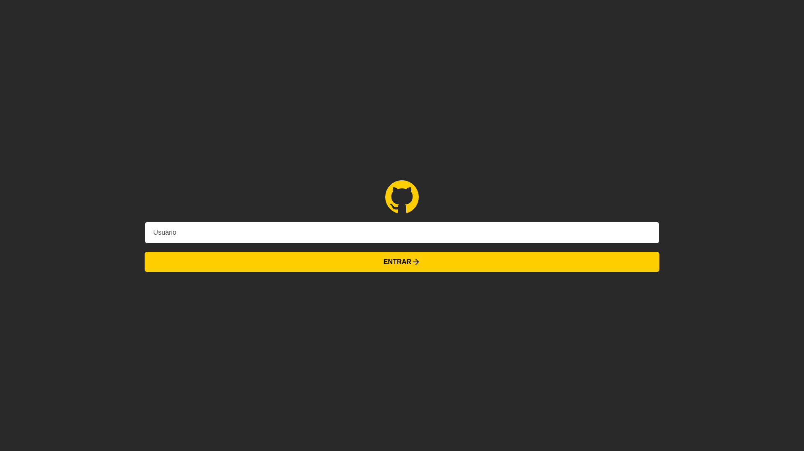

<h1 align="center">Github Finder</h1>

<p align="center">
  
  
</p>

<p align="center">
  
</p>

<h2>:computer: Projeto:</h2>
<p align="center">  
  <strong>Aplicação para encontrar informações de usuários do GitHub.</strong>
</p>

<br />

## :rocket: Tecnologias utilizadas:

* [React](https://react.dev)
* [SASS](https://sass-lang.com)
* [Typescript](https://www.typescriptlang.org/)
* [TanStack Query](https://tanstack.com/query/latest)
* [Phosphor Icons](https://phosphoricons.com)
* [Axios](https://axios-http.com/)

### :globe_with_meridians: Rodando o Front End (Web)

```bash
# Instale as dependências
$ npm install

## ou

$ yarn install

## ou

$ pnpm install

# Execute a aplicação em modo de desenvolvimento
$ npm dev

## ou

$ yarn dev

## ou

$ pnpm dev

```

# :memo: Licença

Esse projeto está sob a licença MIT. Veja o arquivo [LICENSE](LICENSE.md) para mais detalhes.
